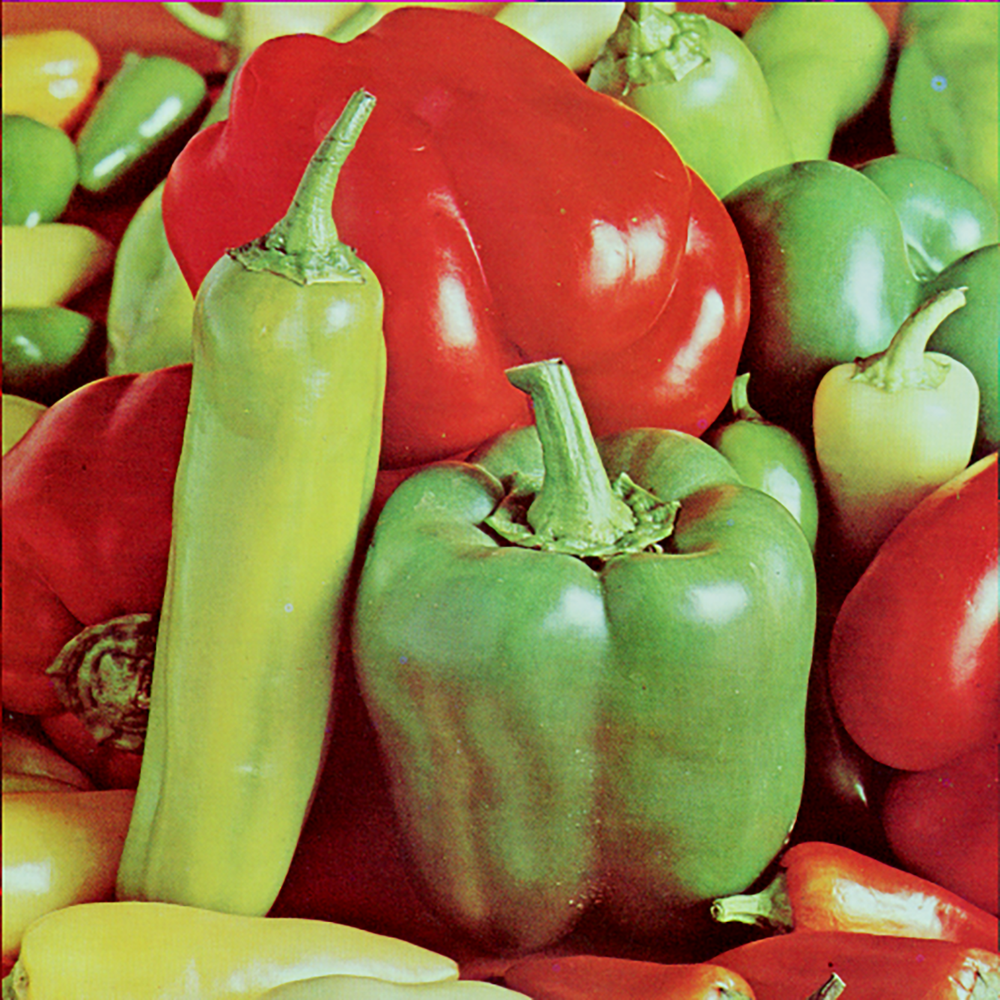
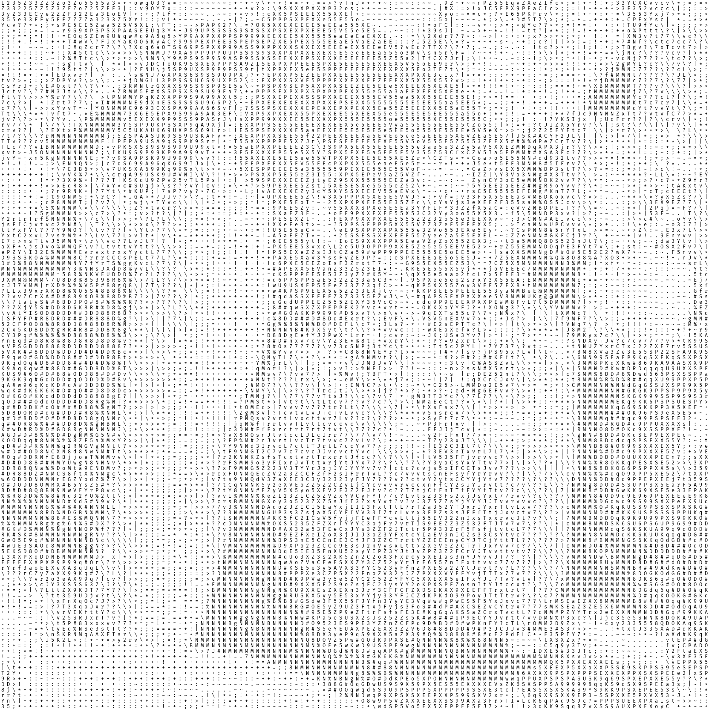

# image2ascii-art

[English](../../../README.md) / 简体中文

Image2ascii-art 包含了许多可以将图片转换为Ascii字符画的工具。

## 示例

| 输入 1 (图片)                         | 输出 1 (图片)                                     | 输出 2 (文本)                                                             |
|-----------------------------------|-----------------------------------------------|-----------------------------------------------------------------------|
|  |  | [vegetables_ascii.txt](../../../examples/output/vegetables_ascii.txt) |

## 特性:

* **输出优化**: 无论你使用何种等宽字体，都可以获得一致的高质量输出。
* **可自定义**: 你可以轻松自定义输入图片大小，Ascii 字符画使用的字符，输出图片的排版和颜色。
* **高度可扩展**: Image2ascii 使用了许多函数来实现工作流。依据函数的输入和输出类型，你能够轻易编写自己的函数并将它们加入工作流。
* **反向转换**: 你可以将文本形式的 Ascii 字符画转换回灰度图片。

## 使用方法:

1. 将本仓库克隆到本地
2. 打开 `src/main.py`
3. 编辑 `input_path`
4. 编辑 `font_path`, 建议使用等宽字体 (ttf 或 otf 格式)。 [更多信息](../../../assets/README.md)
5. 运行，并检查 `examples/output` 下的输出

## 待办事项

- [x] 支持其他字体格式 (目前仅支持 ttf)
- [x] 类型检查和异常处理
- [ ] 文档
- [ ] 其他功能上的增强

## License

Apache-2.0 License