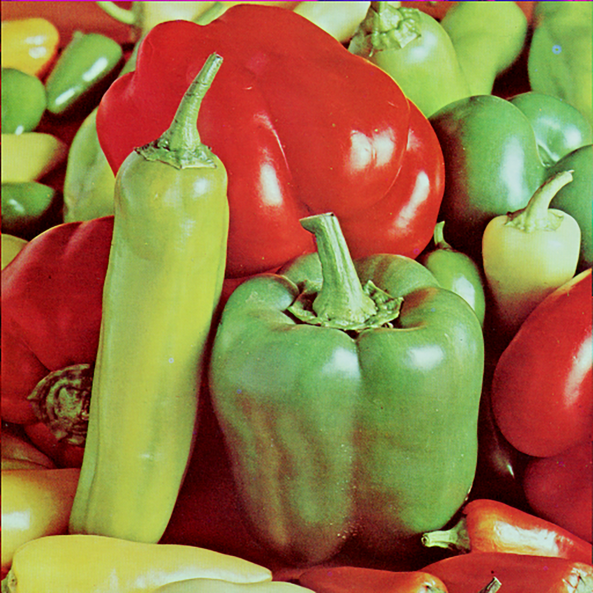
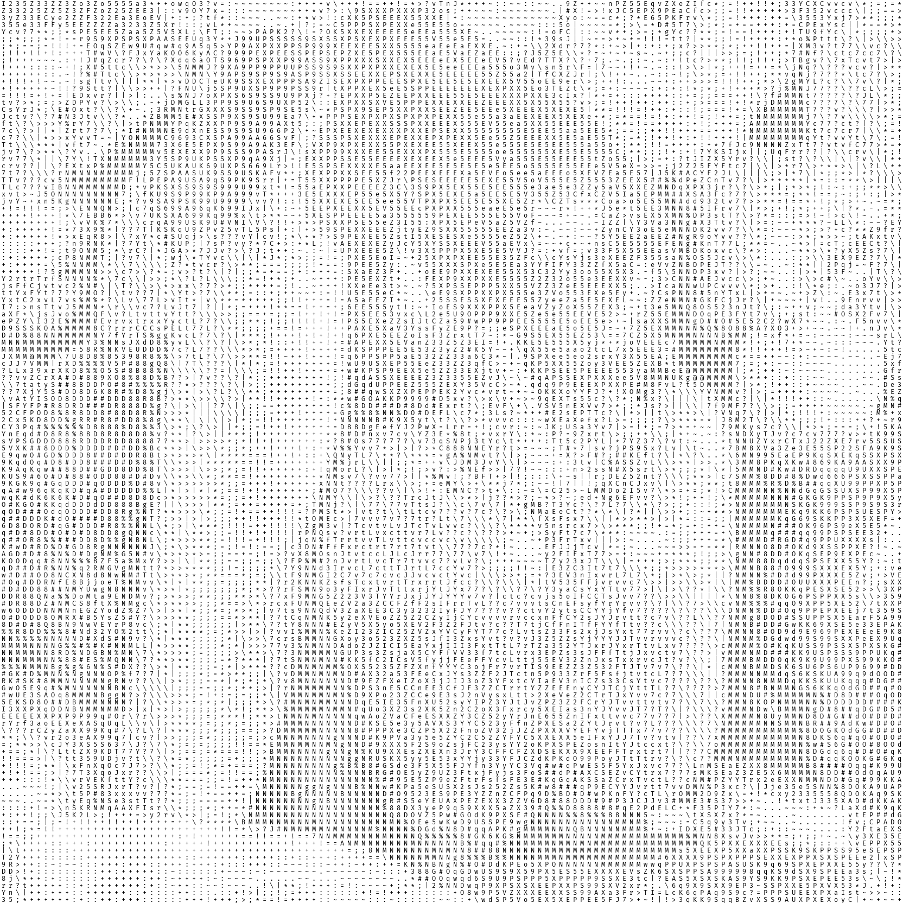

# image2ascii-art

English / [简体中文](github/resources/mainpage/README_CHS.md)

Image2ascii-art contains multiple tools to convert a picture into a monochrome Ascii Art.

## Examples
| Input1 (Picture)                                            | Output1 (Picture)                                                       | Output2 (Text)                                               |
| ----------------------------------------------------------- | ----------------------------------------------------------------------- | ------------------------------------------------------------ |
|  |  | [vegetables_ascii.txt](examples/output/vegetables_ascii.txt) |
|  |  | [gray-scale_ascii.txt](examples/output/gray-scale_ascii.txt) |

## Features:
* **Optimized output**: No matter what monospace fonts you use, you can have a high quality output.
* **Customizable**: You can easily change the input size, glyphs in the Ascii Art, output picture's typesetting and color, etc.
* **High Scalability**: Image2ascii defines lots of functions to achieve a workflow. Based on their input and output type, you can easily write your own functions and add them to the workflow.

## Usage:
1. Clone this repo.
2. Open `src/main.py`
3. Edit `input_path`
4. Edit `font_path`, you can use any monospace font (ttf format). More information: [click me](assets/README.md)
5. Run and check `examples/output`

## To-Do List
- [ ] Support other font format (Only ttf is supported now)
- [ ] Type check and error handle
- [ ] Docs
- [ ] Other enhancement

## License
Apache-2.0 License